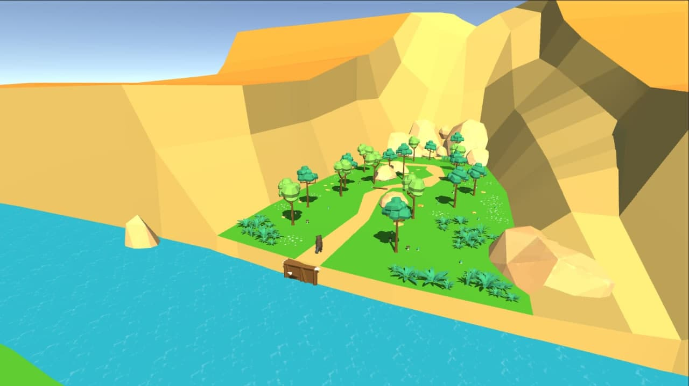
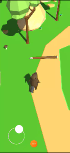
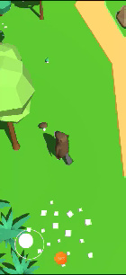
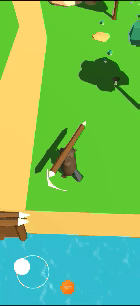

# Beaver-Lumberjack
###### Android Mobile game Developed with Unity(2020.3.13f1)

#### Be a Beaver!
Gnaw tree, build your dam and block the river.

In this game you can live a life of beaver.
You have to gnaw on trees in a forest and draw them to the river.
On the river you have to build a dam to block it and rise a water level.
Very calm and relaxing game.
Good to play with children who love animals.

### The game consists of three modes.
- Find the tree
- Gnaw on a tree
- Build a Dam

## Find the tree

Character control is implemented by using the Joystick asset.
The tree is marked with an aura when the player approaches

There are 2 types of trees and you can collect only one type of them.
 
 
 
 
 
 
 
 
 
 

## Gnaw on a tree

Character control is implemented by using the LeanTouch asset.
The player must perform Slide a several number of times to switch to the next game mode.

**Progress** Bainforms about the state of the tree.  
**Sawdust** is made with Unity Particle system

 
 
 
 
 
 

## Build a Dam

Character control is implemented by using the LeanTouch asset.
The player must tap a certain number of times to enter the "Find the tree" game mode.
Progress Bar informs about the state of your dam

 
 
 
 
 
 
 
 
 
 
 
 

The game ends when all **sections** of the dam have _been built._
